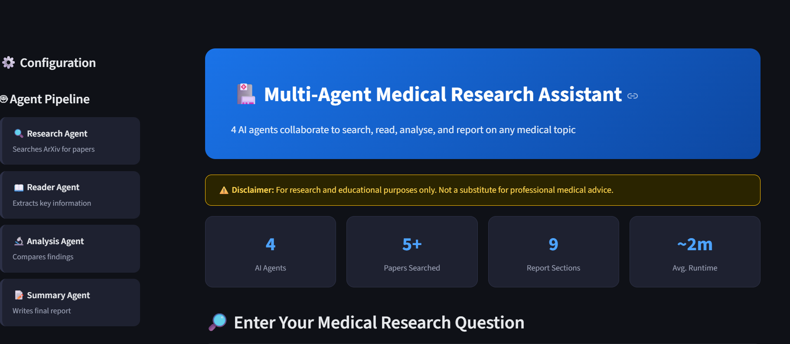
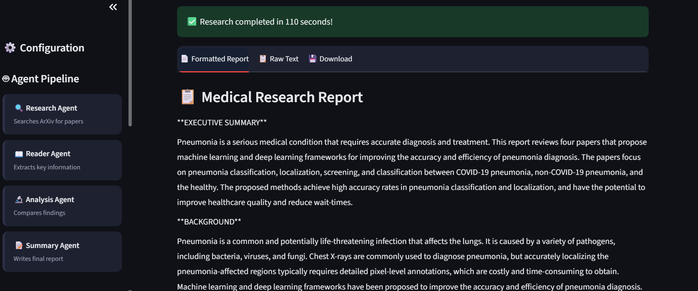

# 🏥 Multi-Agent Medical Research Assistant

> An AI-powered system where **4 specialized agents collaborate** to search, read, analyse, and report on any medical research topic — powered by CrewAI, Groq, and ArXiv.


---

## 📸 Demo





---

## 🧠 How It Works

The system runs **4 AI agents sequentially**, each passing its output to the next:

```
User Question
      │
      ▼
┌─────────────────────┐
│  🔍 Research Agent  │  Searches ArXiv with 2-3 queries → finds 4+ papers
└─────────┬───────────┘
          │
          ▼
┌─────────────────────┐
│  📖 Reader Agent    │  Extracts: hypothesis, methodology, findings, limitations
└─────────┬───────────┘
          │
          ▼
┌─────────────────────┐
│  🔬 Analysis Agent  │  Compares papers: consensus, contradictions, gaps
└─────────┬───────────┘
          │
          ▼
┌─────────────────────┐
│  📝 Summary Agent   │  Writes 9-section professional research report
└─────────────────────┘
          │
          ▼
   📄 Final Report (displayed in UI + saved as .txt)
```

---

## 🚀 Features

- ✅ **4 collaborative AI agents** running sequentially via CrewAI
- ✅ **ArXiv integration** — searches real peer-reviewed papers
- ✅ **Streamlit UI** — dark-themed, clean, professional interface
- ✅ **Auto retry** on Groq rate limits with smart wait logic
- ✅ **9-section structured report** — executive summary to conclusion
- ✅ **Download report** as `.txt` file
- ✅ **Rate limit protection** — `max_rpm` and `max_tokens` configured
- ✅ **API key hidden** — loaded from `.env`, never exposed in UI

---

## 🗂️ Project Structure

```
medical-agent/
│
├── app.py              # Streamlit UI — run this to launch the app
├── main.py             # CLI entry point — run without UI
├── agents.py           # 4 AI agent definitions (role, goal, backstory)
├── tasks.py            # 4 task definitions with context chaining
├── tools.py            # ArXiv search tool (@tool decorator)
│
├── .env                # API keys (never commit this!)
├── .gitignore          # Excludes .env, __pycache__, reports/, .venv/
├── requirements.txt    # All dependencies
│
├── reports/            # Auto-generated research reports saved here
│
└── .github/
    └── workflows/
        ├── ci.yml      # CI — runs on every push/PR (lint + test)
```

---

## ⚙️ Setup & Installation

### Prerequisites
- Python **3.12** (required — CrewAI doesn't support 3.13/3.14)
- A free **Groq API key** → [console.groq.com](https://console.groq.com)

### 1. Clone the repository
```bash
git clone https://github.com/ashishak2505/Medical-ai-agent.git
```

### 2. Create a virtual environment
```bash
# Windows
py -3.12 -m venv .venv
.venv\Scripts\Activate.ps1

# Mac / Linux
python3.12 -m venv .venv
source .venv/bin/activate
```

### 3. Install dependencies
```bash
pip install -r requirements.txt
pip install litellm
```

### 4. Configure your API key
Create a `.env` file in the project root:
```env
GROQ_API_KEY=your_groq_api_key_here
```
> ⚠️ **Never commit your `.env` file.** It is already in `.gitignore`.

### 5. Run the Streamlit UI
```bash
streamlit run app.py
```

### 6. Or run via CLI
```bash
python main.py
```

---

## 🧪 Running Tests

```bash
pip install pytest
pytest tests/ -v
```

---

## 📦 Dependencies

| Package | Version | Purpose |
|---|---|---|
| `crewai` | 1.10.1 | Multi-agent orchestration |
| `litellm` | latest | LLM provider bridge |
| `groq` | 0.9.0 | Groq API client |
| `arxiv` | 2.1.0 | ArXiv paper search |
| `streamlit` | ≥1.32.0 | Web UI |
| `python-dotenv` | 1.1.1 | Environment variable loading |
| `langchain-groq` | 0.3.0 | LangChain-Groq integration |

---

## 🤖 Agent Details

| Agent | Role | Tools |
|---|---|---|
| **Research Agent** | Medical Research Specialist | ArXiv Search |
| **Reader Agent** | Medical Literature Analyst | None (reads context) |
| **Analysis Agent** | Comparative Research Analyst | None (reads context) |
| **Summary Agent** | Medical Report Writer | None (reads context) |

---

## 📋 Sample Research Questions

```
What are the latest treatments for drug-resistant tuberculosis?
How does mRNA vaccine technology affect long-term immunity?
What is the role of gut microbiome in mental health disorders?
What are the risk factors for early-onset Alzheimer's disease?
How does deep learning improve cancer diagnosis accuracy?
```

> ⚠️ Enter **one question at a time** for best results.

---

## ⚠️ Disclaimer

This tool is for **research and educational purposes only**.
It does not provide medical advice. Always consult a qualified healthcare professional.

---

## 📄 License

This project is licensed under the **MIT License** — see [LICENSE](LICENSE) for details.

---

## 🙌 Acknowledgements

- [CrewAI](https://crewai.com) — multi-agent framework
- [Groq](https://groq.com) — ultra-fast LLM inference
- [ArXiv](https://arxiv.org) — open-access research papers
- [Streamlit](https://streamlit.io) — rapid UI framework